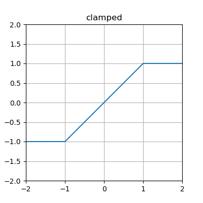
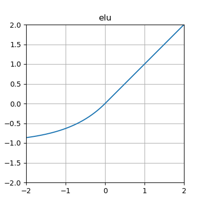
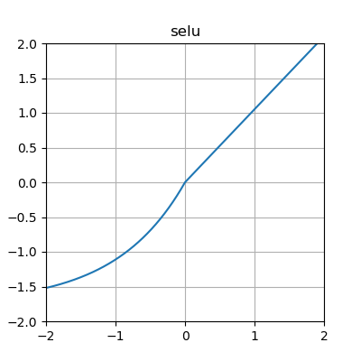
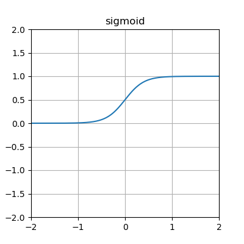
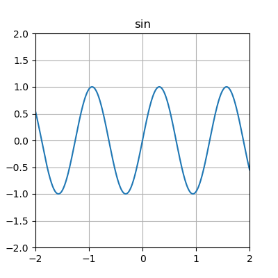
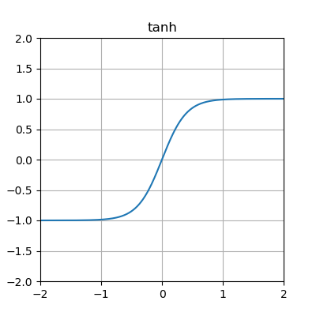

.. _activation-functions-label:

Overview of builtin activation functions
========================================

.. index:: ! activation function

Note that some of these :term:`functions <activation function>` are scaled differently from the canonical
versions you may be familiar with.  The intention of the scaling is to place
more of the functions' "interesting" behavior in the region :math:`\left[-1, 1\right] \times \left[-1, 1\right]`.

The implementation of these functions can be found in the :py:mod:`activations` module.

abs
---

.. figure:: _static/activation-abs.png
   :scale: 50 %
   :alt: absolute value function

clamped
-------

cube
----

.. figure:: _static/activation-cube.png
   :scale: 50 %
   :alt: cubic function

exp
---

.. figure:: _static/activation-exp.png
   :scale: 50 %
   :alt: exponential function

gauss
-----

.. figure:: _static/activation-gauss.png
   :scale: 50 %
   :alt: gaussian function

hat
---

.. figure:: _static/activation-hat.png
   :scale: 50 %
   :alt: hat function

.. _identity-label:

identity
--------

.. figure:: _static/activation-identity.png
   :scale: 50 %
   :alt: identity function

inv
---

.. figure:: _static/activation-inv.png
   :scale: 50 %
   :alt: inverse function

log
---

.. figure:: _static/activation-log.png
   :scale: 50 %
   :alt: log function

relu
----

.. figure:: _static/activation-relu.png
   :scale: 50 %
   :alt: rectified linear function

elu
----

lelu
----

.. figure:: _static/activation-lelu.png
   :scale: 50 %
   :alt: leaky rectified linear function

selu
----

.. _sigmoid-label:

sigmoid
-------

sin
---

softplus
--------

.. figure:: _static/activation-softplus.png
   :scale: 50 %
   :alt: soft-plus function

square
------

.. figure:: _static/activation-square.png
   :scale: 50 %
   :alt: square function

tanh
----

