.. _activation-functions-label:

Overview of builtin activation functions
========================================

Note that some of these :index:`functions <activation function>` are scaled differently from the canonical
versions you may be familiar with.  The intention of the scaling is to place
more of the functions' "interesting" behavior in the region :math:`\left[-1, 1\right] \times \left[-1, 1\right]`.

The implementation of these functions can be found in the `activations module
<https://github.com/CodeReclaimers/neat-python/blob/master/neat/activations.py>`_.

abs
---

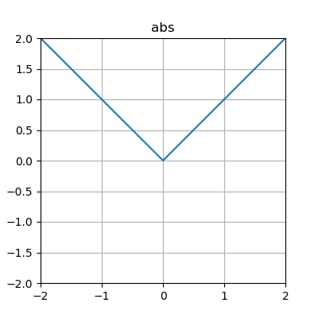

clamped
-------

.. figure:: activation-clamped.png
   :scale: 50 %
   :alt: clamped linear function

cube
----

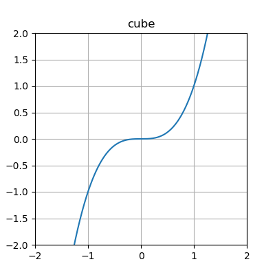

exp
---

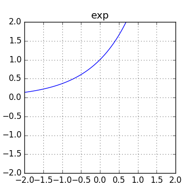

gauss
-----

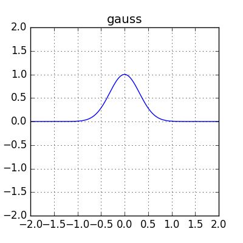

hat
---

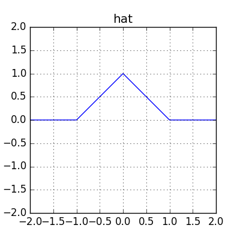

identity
--------

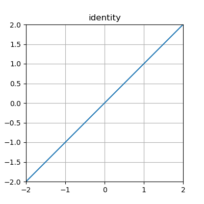

inv
---

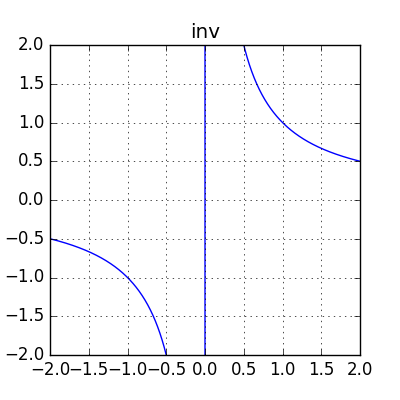

log
---

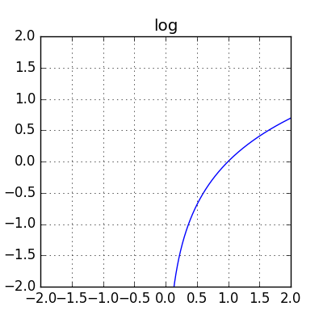

relu
----

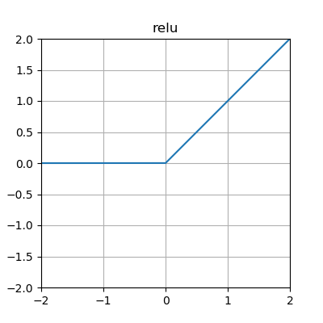

sigmoid
-------

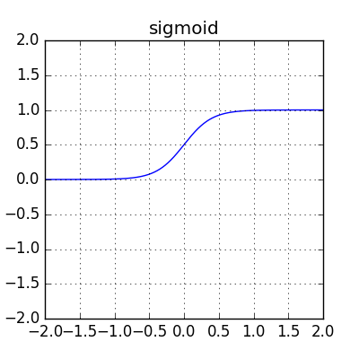

sin
---

.. figure:: activation-sin.png
   :scale: 50 %
   :alt: sine function

softplus
--------

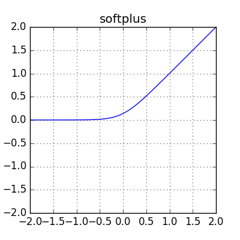

square
------

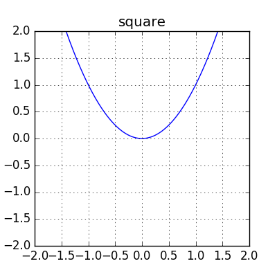

tanh
----

.. figure:: activation-tanh.png
   :scale: 50 %
   :alt: hyperbolic tangent function

