.. _activation-functions-label:

Overview of builtin activation functions
========================================

.. index:: ! activation function

Note that some of these :term:`functions <activation function>` are scaled differently from the canonical
versions you may be familiar with.  The intention of the scaling is to place
more of the functions' "interesting" behavior in the region :math:`\left[-1, 1\right] \times \left[-1, 1\right]`.

The implementation of these functions can be found in the :py:mod:`activations` module.

The following table summarizes the scaling, clamping, and non-canonical
behavior of the activation functions that differ from their textbook forms.
Input ``z`` is clamped to the given range before any output transform is
applied. Functions not listed below (``relu``, ``elu``, ``selu``, ``identity``,
``clamped``, ``abs``, ``hat``, ``square``, ``cube``) apply their canonical
transforms directly with no scaling or clamping.

+-------------+--------------------+----------------+------------------------------------------------+
| Function    | Input clamp        | Scaling        | Transform                                      |
+=============+====================+================+================================================+
| sigmoid     | ±60 after 5×z      | 5× input       | :math:`1 / (1 + e^{-5z})`                      |
+-------------+--------------------+----------------+------------------------------------------------+
| tanh        | ±60 after 2.5×z    | 2.5× input     | :math:`\tanh(2.5\,z)`                          |
+-------------+--------------------+----------------+------------------------------------------------+
| sin         | ±60 after 5×z      | 5× input       | :math:`\sin(5\,z)`                             |
+-------------+--------------------+----------------+------------------------------------------------+
| gauss       | ±3.4               | −5 in exponent | :math:`e^{-5 z^2}`                             |
+-------------+--------------------+----------------+------------------------------------------------+
| softplus    | ±60 after 5×z      | 5× in, 0.2× out| :math:`0.2 \log(1 + e^{5z})`                   |
+-------------+--------------------+----------------+------------------------------------------------+
| exp         | ±60                | none           | :math:`e^{z}`                                  |
+-------------+--------------------+----------------+------------------------------------------------+
| log         | floor at ``1e-7``  | none           | :math:`\log(\max(10^{-7}, z))` — non-positive  |
|             |                    |                | inputs yield :math:`\log(10^{-7}) \approx      |
|             |                    |                | -16.118` rather than ``ValueError``.           |
+-------------+--------------------+----------------+------------------------------------------------+
| inv         | none               | none           | :math:`1/z`, returning ``0.0`` on              |
|             |                    |                | ``ArithmeticError`` (e.g. division by zero     |
|             |                    |                | or overflow).                                  |
+-------------+--------------------+----------------+------------------------------------------------+
| lelu        | none               | none           | :math:`z` if :math:`z > 0`, otherwise          |
|             |                    |                | :math:`0.005\,z`. **Note: non-standard leak    |
|             |                    |                | coefficient** — the conventional leaky ReLU    |
|             |                    |                | uses ``0.01`` (e.g. PyTorch's                  |
|             |                    |                | ``nn.LeakyReLU`` default).                     |
+-------------+--------------------+----------------+------------------------------------------------+

abs
---

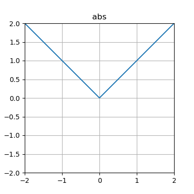

clamped
-------

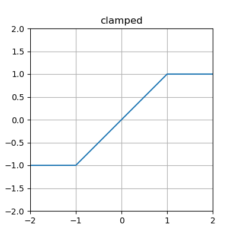

cube
----

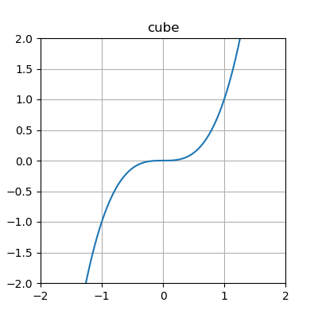

exp
---

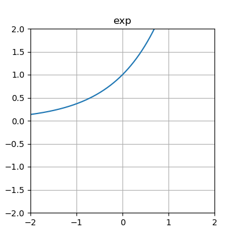

gauss
-----

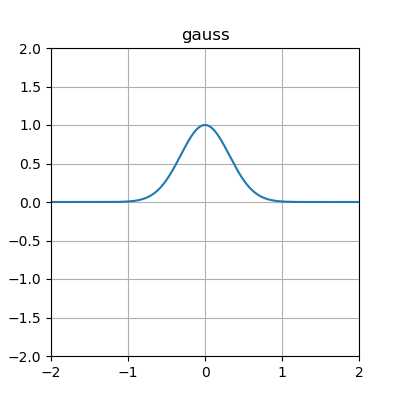

hat
---

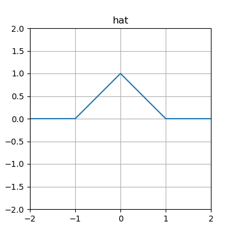

.. _identity-label:

identity
--------

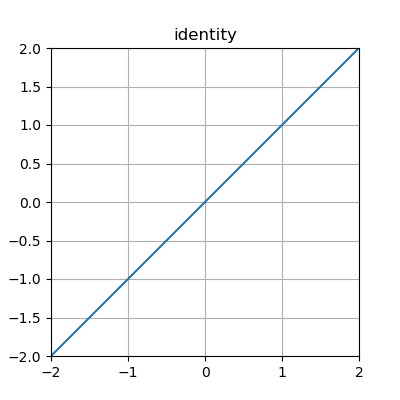

inv
---

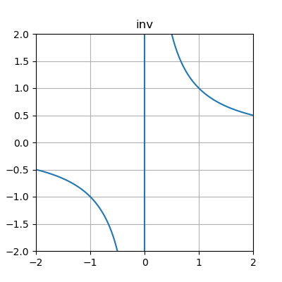

log
---

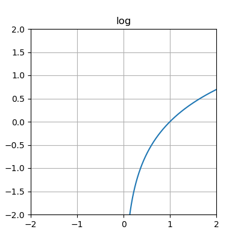

relu
----

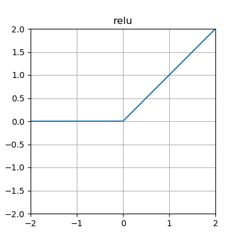

elu
----

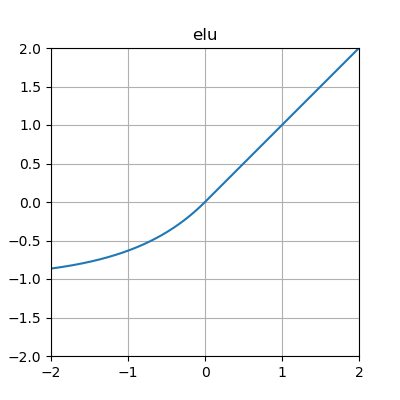

lelu
----

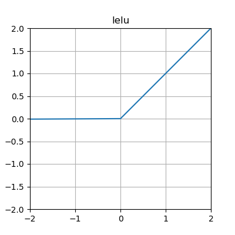

selu
----

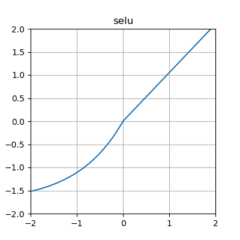

.. _sigmoid-label:

sigmoid
-------

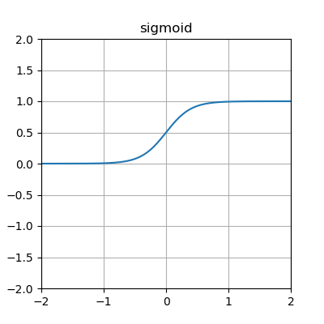

sin
---

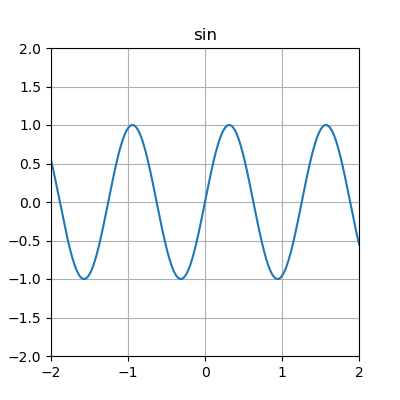

softplus
--------

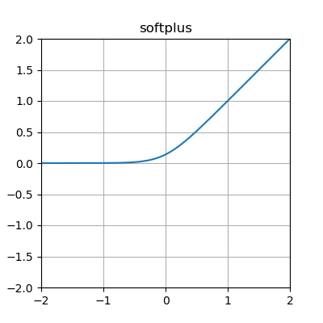

square
------

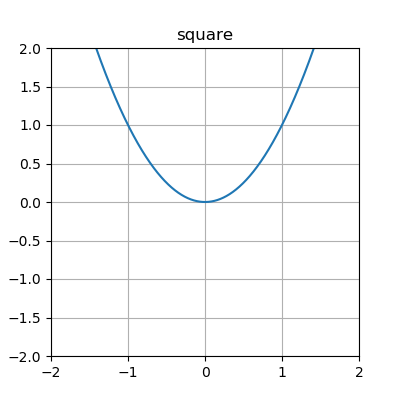

tanh
----

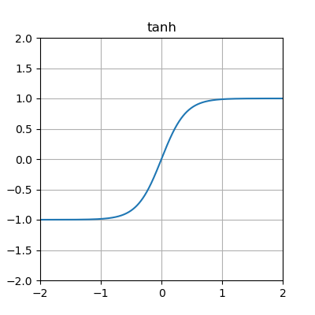
